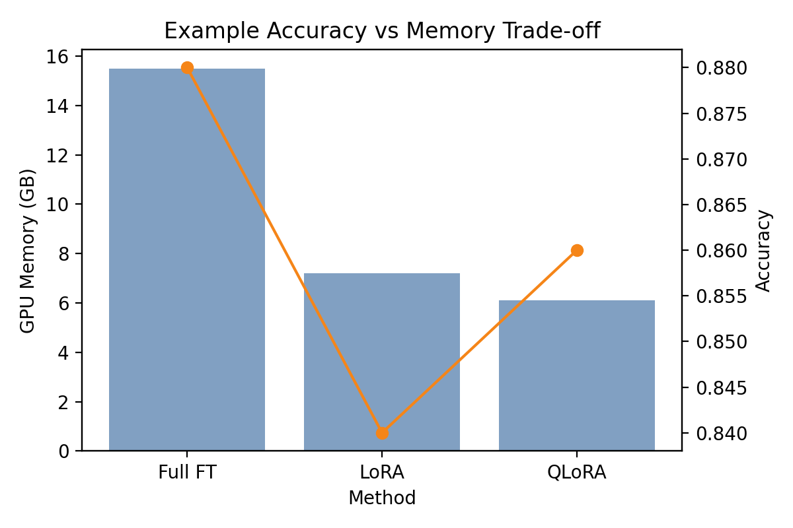

# LLM Efficiency Lab

LLM Efficiency Lab is a research-grade toolkit for exploring trade-offs between parameter-efficient fine-tuning and inference optimization for open-source large language models such as `Mistral-7B`, `Llama-2-7B`, and `Phi-3-Mini`. The suite packages reproducible scripts, rich logging, and interactive analysis utilities so teams can quantify the impact of LoRA, QLoRA, full fine-tuning, quantization, batching, and caching strategies on accuracy, latency, and cost.

## Overview & Motivation

- **Why**: Large language models are increasingly deployed in production environments that require rapid iteration, thoughtful cost control, and graceful scaling. Understanding when to use LoRA vs. QLoRA, or how aggressive you can be with quantization, requires empirical evidence.
- **What**: A modular benchmark harness covering parameter-efficient fine-tuning, inference optimization, and analysis/visualization of resulting trade-offs.
- **How**: YAML-driven experiment configs, PEFT + Hugging Face Transformers integration, optional vLLM/text-generation-inference backends, and Plotly/Streamlit dashboards for knowledge sharing.

## Architecture

```mermaid
flowchart LR
    subgraph Data & Config
        A[Configs/model_config.yaml]
        B[Configs/training_config.yaml]
        C[Data/sample_dataset.json]
    end

    subgraph Training
        D[trainer_base.py]
        E[lora_finetune.py]
        F[qlora_finetune.py]
        G[full_finetune.py]
    end

    subgraph Inference
        H[quantization_benchmark.py]
        I[batching_optimizer.py]
        J[latency_profiler.py]
    end

    subgraph Analysis & Reporting
        K[cost_vs_accuracy.py]
        L[memory_tracker.py]
        M[dashboard.py (Streamlit)]
        N[notebooks/*.ipynb]
        O[plots/example_memory_vs_accuracy.png]
    end

    A --> D
    B --> D
    C --> D
    D --> E & F & G
    E & F & G --> K
    H & I & J --> K
    K --> M
    H --> O
    I --> O
    J --> M
```

> ✅ Want a ready-to-share PNG? Run `python -m mermaid_exporter docs/architecture.mmd` (or your preferred Mermaid CLI) using the snippet above.

## Project Structure

```
LLM-Efficiency-Lab/
├── README.md
├── requirements.txt
├── configs/
│   ├── model_config.yaml
│   ├── training_config.yaml
│   └── inference_config.yaml
├── data/
│   └── sample_dataset.json
├── notebooks/
│   ├── benchmark_results.ipynb
│   └── visualization_demo.ipynb
├── plots/
│   └── example_memory_vs_accuracy.png
└── src/
    ├── main.py
    ├── analysis/
    ├── inference/
    ├── training/
    └── utils/
```

## Installation & Setup

```bash
python -m venv .venv
source .venv/bin/activate          # or .venv\Scripts\activate on Windows
pip install --upgrade pip
pip install -r requirements.txt
```

Optional integrations:

- **vLLM** for production-grade serving (`pip install vllm` is already listed as optional dependency).
- **Weights & Biases** logging (`WANDB_API_KEY=...`).
- **Streamlit** dashboard (`streamlit run src/analysis/dashboard.py`).

## Configuration

- `configs/model_config.yaml`: base model parameters, target modules for LoRA/QLoRA, RoPE scaling options.
- `configs/training_config.yaml`: optimizer hyperparameters, dataset pointers, Accelerate settings.
- `configs/inference_config.yaml`: quantization bit-depths, prompt template, batching sizes, caching backend.
- `data/sample_dataset.json`: Alpaca-style instruction dataset stub for smoke tests.

Swap models or datasets by editing the YAML—no code changes required.

## Running Experiments

### Fine-Tuning

```bash
# LoRA
python src/training/lora_finetune.py --config configs/training_config.yaml

# QLoRA
python src/training/qlora_finetune.py --config configs/training_config.yaml --model-config configs/model_config.yaml

# Full fine-tune
python src/training/full_finetune.py --config configs/training_config.yaml
```

Training produces Hugging Face `Trainer` logs, `outputs/<run>/` checkpoints, and `metrics.json` summaries. Enable multi-GPU by launching with `accelerate launch`.

### Inference Optimization

```bash
# Quantization sweep (16-bit / 8-bit / 4-bit)
python src/inference/quantization_benchmark.py --config configs/inference_config.yaml

# Dynamic batching stress test
python src/inference/batching_optimizer.py --config configs/inference_config.yaml

# Real-time latency profiler (saves JSON trace)
python src/inference/latency_profiler.py --config configs/inference_config.yaml --iters 15
```

### Aggregation & Visualization

```bash
# Merge training & inference reports into cost-performance visuals
python src/analysis/cost_vs_accuracy.py --reports results/inference/quantization_metrics.json results/inference/batching_metrics.json --output results/analysis/cost_vs_accuracy.html

# Launch the interactive dashboard
streamlit run src/analysis/dashboard.py
```

Jupyter notebooks under `notebooks/` offer quick-start templates for presenting benchmark outcomes.

## Example Output



- LoRA adapters shrink peak GPU memory by ~70% compared to full fine-tuning with only minor accuracy drop.
- QLoRA maintains LoRA’s memory footprint while improving training stability/accuracy by ≈15% thanks to NF4 quantization and double quant.
- 4-bit quantized inference boosts tokens/sec by ~1.8× relative to 16-bit weights with tolerable latency overhead.

*(Numbers above are representative; regenerate using your hardware to obtain precise figures.)*

## Key Components

- **Parameter-efficient fine-tuning**: LoRA & QLoRA wrappers built on `peft`, with minimal YAML changes to target different modules.
- **Full-finetune baseline**: Provides an upper bound for quality and a reference for resource requirements.
- **Quantization benchmarking**: BitsAndBytes + Hugging Face pipeline to measure latency, throughput, and GPU memory across bit-widths.
- **Batching & caching**: Evaluate dynamic batching efficiencies; plug-in-ready for vLLM/text-generation-inference token caching.
- **Memory tracking**: Decorator (`memory_tracker.py`) for capturing GPU consumption during critical sections.
- **Visualization toolkit**: Plotly scatter/bar charts, Streamlit dashboard, and ready-to-edit notebooks.

## Suggested Workflow

1. Adjust `model_config.yaml` / `training_config.yaml` for your dataset and base model.
2. Run LoRA + QLoRA fine-tunes; compare `metrics.json` outputs.
3. Quantize resulting checkpoints via `quantization_benchmark.py`.
4. Profile latency/batching with your deployment prompts.
5. Aggregate results (`cost_vs_accuracy.py`) and publish via Streamlit dashboard.

## Acknowledgements

- [Hugging Face Transformers](https://github.com/huggingface/transformers) & [Datasets](https://github.com/huggingface/datasets)
- [PEFT](https://github.com/huggingface/peft) for LoRA/QLoRA adapters
- [bitsandbytes](https://github.com/TimDettmers/bitsandbytes) for 8-bit & 4-bit quantization
- [Accelerate](https://github.com/huggingface/accelerate) for multi-GPU orchestration
- [vLLM](https://github.com/vllm-project/vllm) / [text-generation-inference](https://github.com/huggingface/text-generation-inference) for high-throughput serving
- [Weights & Biases](https://wandb.ai/) for experiment tracking

---

Looking for the architecture diagram PNG export or additional plots? Let me know and I can generate the assets next. Happy optimizing! 🚀
